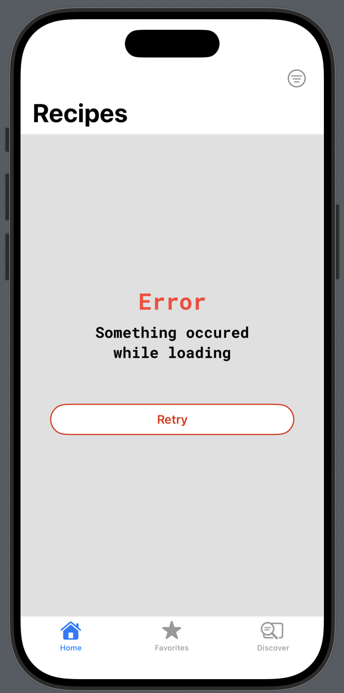
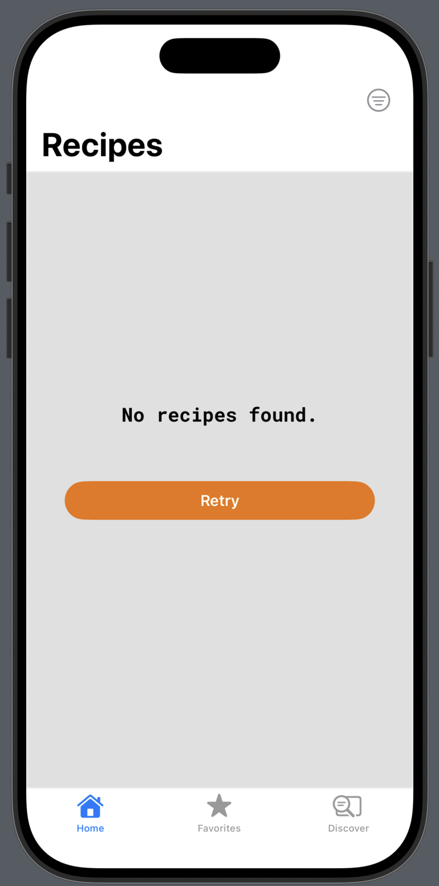
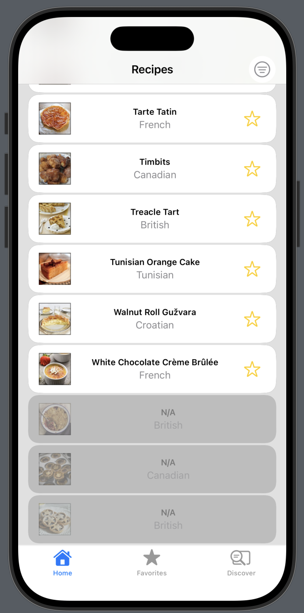
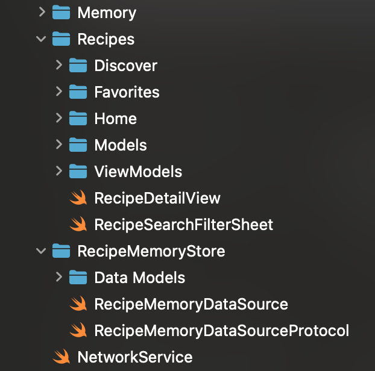
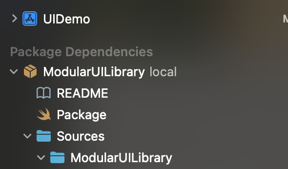

### Summary: Include screen shots or a video of your app highlighting its features
QUICK NOTE: All code is original and mine, including the ModularUILibrary, which is also available on my github.

# Core App Flow

- App Flow

App launches without a hitch and loads the recipe list from the Network. Recipe rows load lazily.
Images load asynchronously via a custom ImageCache. ProgressView provides feedback to user. First time cached images
predictably takes a moment, but on returning to previously loaded images it instantly loads from local memory.
Pull-to-Refresh flushes cache and images request from network again. (see ProgressView for each image again while load).

https://github.com/user-attachments/assets/2a1ccb1a-9485-4558-bcfe-1c70c1440610

Click on any recipe to view it in more detail. Detailed view shows larger image in a different composable view.
If the recipe has a valid video or source url, you can visit each link by pressing each button. To view video a sheet
opens to load source video. To view source, click on source and a safari window opens through Webkit. Notes section
allows you to add notes about the recipe. To activate, the user needs to add the recipe to favorites by clicking on
the start icon. Once added the notes window changes and guides the user to add note. The user may add any number of notes.
To delete a note, prese and hold the notes and follow instructions. Notes persist as do favorites. 

https://github.com/user-attachments/assets/f2b6e750-60d4-4344-b826-3d44fe2c7ac8

The Favorites tab is a place to view all your favorited recipes. It uses a different composable card view that gives 
a quick but detailed overview of each for quick reference. The video and source Icons inform the user on what's available
and the notes section features any notes the user has added. Click on a recipe to see it in more detail.

https://github.com/user-attachments/assets/8d176cb0-77fc-48a2-a000-11653b6795d8

Don't have a favorite recipe? No worries! Go to the discover tab and view a random one!

https://github.com/user-attachments/assets/ca0a1377-c153-4a8e-bff1-e0bcc42b83c9


Use the search bar to find a recipe by name. Alternately, press the filter button to open the filter sheet and look for
a specific cuisine.

https://github.com/user-attachments/assets/6f841fba-bfb8-439f-b14a-0912d9bed325

Some useful state feedback include loading error, empty results, and malformed data. Although you requested that a list
of recipes be entirely disregarded if a recipe is malformed, I made the design decision to provide feedback for the
malformed recipes rather than discard the list. I believe in user friendly design first, and discarding the entire list
because of a few malformed entries provides an incomplete and frustrating experience. Instead, I display a row for the 
malformed entries at the end of the list, and display anything that was available. Internally, the object holds useful
feedback to the developer about which recipes are malformed and what parts of the required fields failed. 






How the the Recipe model is future proofed to provide useful feedback.

```
    var isValid: Bool {
        _id != nil && _cuisine != nil && _name != nil
    }
    
    // Required Fields. Note that they take their value from underlying assumptions that these are required.
    var id: UUID { _id ?? UUID() }
    var cuisine: String { _cuisine ?? "N/A" }
    var name: String { _name ?? "N/A" }
    
    // Underlying required vars. We allow for the data model to not fail and still provide feedback on what failed.
    let _id: UUID?
    let _cuisine: String?
    let _name: String?
    let _uuidString: String? /* The response model may have malformed uuid still. our default behavior gives it an id
                              to work with our logic, but this allows us to see what the original value was. */
```


### Focus Areas: What specific areas of the project did you prioritize? Why did you choose to focus on these areas?

I prioritized architecture above all. I’ve seen firsthand how bad architectural decisions create long-term pain, 
so I focused early on setting up a clean, composable structure rooted in Swift’s reactivity model. Most UI quirks 
and redraw bugs were solved not through patches, but by refactoring how Viewmodels are injected. For example,
moving to a factory constructor approach helped eliminate tight coupling and made views easier to reuse and test.

Another major focus was unit testing. While not exhaustive, the tests I wrote surfaced real bugs faster than SwiftUI 
previews ever could. It reinforced my belief that testability and architecture go hand in hand.

Lastly, organization mattered. I treated this like real production code: folders, files, and responsibilities are 
clearly divided. It should be immediately understandable to any engineer stepping in.




### Time Spent: Approximately how long did you spend working on this project? How did you allocate your time?

Roughly 6 weeks total. A good portion of that overlapped with active development on my ModularUILibrary, which powers 
much of the UI for this project. This allowed me to work efficiently across both domains. Whenever reusable views
showed up during implementation, I pulled it out, generalized it, and added it into my library and back into the app.
For example, the body of `ImageCard` was something i found myself using often, so I pulled it aside and evaluated its
composability. I decided it is useful enough and general enough to be a useful component in my library so I added it to
ModularUILibrary. On the other hand, if a component I was building was a specialized view specific to the context of 
the app, then I still generalized it as much as i could so that I could reause it on other composable views.
`RandomRecipeButton` is one such view. Following this pattern has already paid off in flexibility and speed of iteration.

### Trade-offs and Decisions: Did you make any significant trade-offs in your approach?

I gave this project enough time to avoid most of the usual compromises. That said, the temptation to "just make it work" 
definitely came up but I held the line on clean architecture and declarative UI design. In the process, I learned a great
deal more about SwiftUI's reactive engine and behaviour. 

One practical issue I ran into was inconsistent behavior between previews and runtime. The previews occasionally flickered 
or misbehaved, while the simulator ran the same code cleanly. I traced this to the lifecycle management of `@StateObject`, 
which is expected to be created within the view that owns it, according to Apple’s documentation. When you violate that by 
passing in an already-instantiated object, SwiftUI previews can act unpredictably.

To solve this cleanly, I adopted a `factory constructor pattern` where instead of passing a raw Viewmodel I passed a closure 
that instantiates the view model inside the view.

```
    // Via ContentView
    init(
        makeHomeVM: @escaping () -> RecipesViewModel,
        makeFavoritesVM: @escaping () -> RecipesViewModel,
        makeDiscoveryVM: @escaping () -> DiscoverViewModel) {
            _homeVM = StateObject(wrappedValue: makeHomeVM())
            _favoritesVM = StateObject(wrappedValue: makeFavoritesVM())
            _discoverVM = StateObject(wrappedValue: makeDiscoveryVM())
        }
```

This guaranteed SwiftUI-owned lifecycles and eliminated the preview quirks. It also kept injection flexible and testable, 
which fits my architectural goals.

The one real trade-off I made was skipping tests for components I judged to be low-risk or purely declarative. In practice, 
that decision held up because none of those areas became bug sources, and my focus stayed on the parts of the stack where bugs 
are more likely to appear like with state, logic, and input/output coordination.

### Weakest Part of the Project: What do you think is the weakest part of your project?

If anything, it’s the incomplete test coverage with a total of 35%. I didn’t write tests for every view or helper method, 
even though I normally strive for fuller coverage. Still, I stand by the decision while still focusing testing efforts where 
they mattered most. It was a strategic omission, not an oversight.

### Additional Information: Is there anything else we should know? Feel free to share any insights or constraints you encountered.

The UI component library used throughout this project is my own: ModularUILibrary. I developed it in parallel and it’s hosted on my GitHub. 
Since you asked not to include third-party libraries, this seemed like a fair and productive exception: I authored it, I maintain it, 
and it reflects how I build UI professionally.



Also, any edge cases or brittle behaviors I encountered were opportunities to evolve the library itself so this project benefitted 
from that feedback loop.
